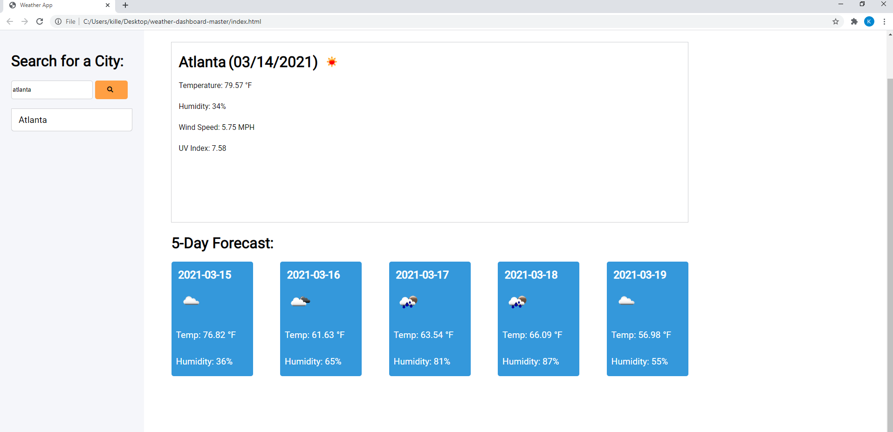

# Weather Application

## Summary 

The application is used to find the a 5-day forecast of a city organized by the humidity, temperature, humidity, windspeed, and UV index. Using the search bar, type your city to find a five day forecast of the specified city.

## Learned 
I learned how to use apis and code formulas to grab and pull apis from websites to use and create applications
## Site Picture 

  
 

## Bugs
I wasnt able to get the clear function to work as a button or a function so the search bar history cannot clear.

## Authors

Ryoma Kobayashi

- [Link to Github](https://github.com/ryokoba689)

